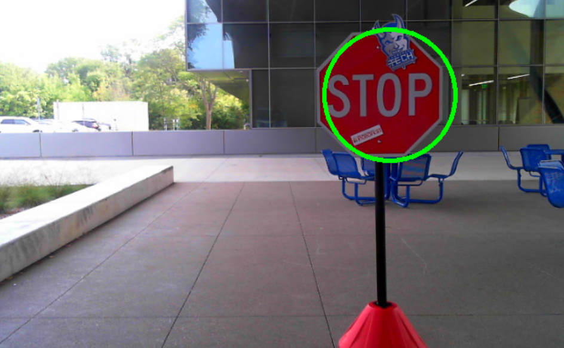

# Sign Detection

Detects if there is a stop sign in front of the car.

  - Publish:
    - **UInt8 on "~/stop_sign"**: Boolean value, true if sign detected, false otherwise
    - **UInt32 on "~/sign_size"**: Size of sign in pixels
  - Subscribe:
    - <params/front_cam_in> *(loaded from config/params.yaml)*
